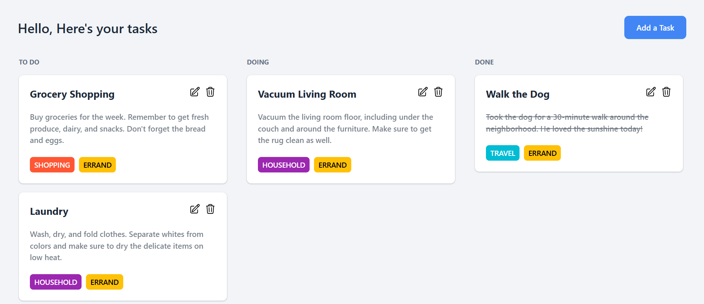

# 📝 To-Do List App

A sleek and modern **To-Do List** application built with **Vue 3**, focused on simplicity, performance, and extensibility. At its core, the app supports full **CRUD** operations — with an evolving enhancement to transform it into a **Kanban-style task board** with **drag-and-drop** functionality.

---

## 🚀 Features

- ✅ **Create, Read, Update, and Delete** tasks
- 🔄 **Persistent state** — your tasks stay even after refreshing the page
- 📱 **Fully responsive** — works beautifully on mobile, tablet, and desktop
- 🧠 **State Management** using [Pinia](https://pinia.vuejs.org/)
- 💅 Styled with [Tailwind CSS](https://tailwindcss.com/)
- 📦 Lightning-fast development with [Vite](https://vitejs.dev/)
- 🔧 Built using Vue 3 **Composition API**

as my personal initiative, i also added these features for better task visualization:
- 🧩 Drag-and-drop interactions with [vue-draggable-next](https://github.com/anish2690/vue-draggable-next)
- 📊 **Kanban-inspired layout** 
---

## 🖼️ Preview



---

## 🛠️ Tech Stack

| Technology             | Purpose                           |
|------------------------|------------------------------------|
| **Vue 3**              | UI Framework (Composition API)    |
| **Vite**               | Build Tool                        |
| **Tailwind CSS**       | Styling & Responsive Layouts      |
| **Pinia**              | State Management                  |
| **Pinia Plugin Persist** | Persistent storage for state       |
| **vue-draggable-next** | Drag-and-drop functionality       |

---


## 🚀 Get Started

Install dependencies and run the development server:

```bash
# Install packages
npm install

# Start the local development server
npm run dev
